# 🗺️ AgriConnect Admin Website - Flowchart

## 📋 Overview

This document provides a comprehensive flowchart of the AgriConnect Admin Website, showing the navigation flow, authentication process, and all available features.

---

## 🔐 Authentication Flow

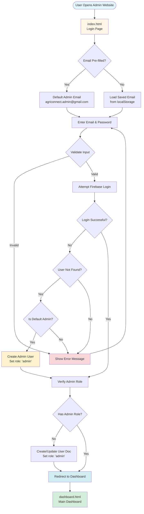

---

## 🏠 Main Navigation Flow

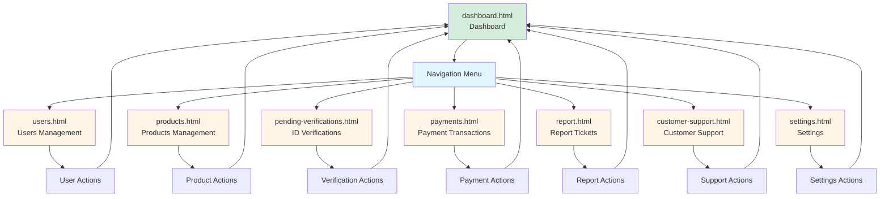

---

## 📊 Dashboard Flow

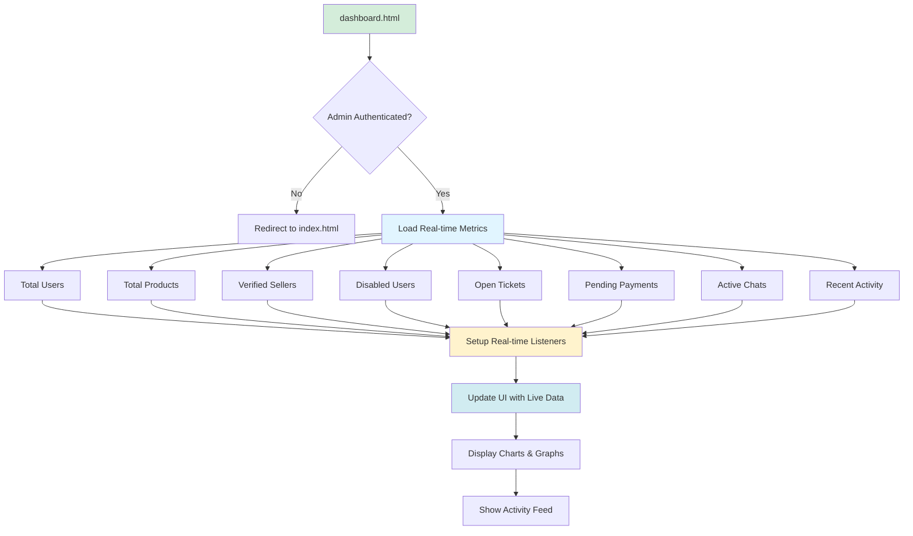

---

## 👥 Users Management Flow

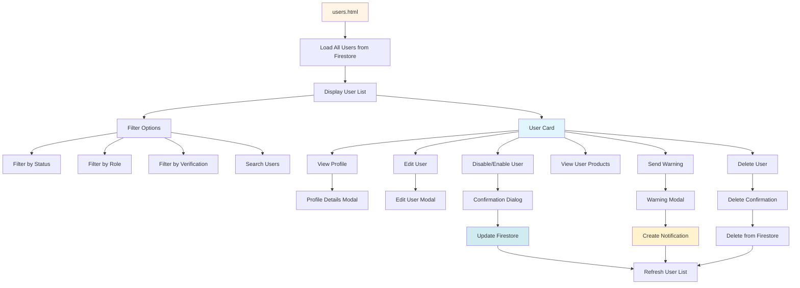

---

## 🛒 Products Management Flow

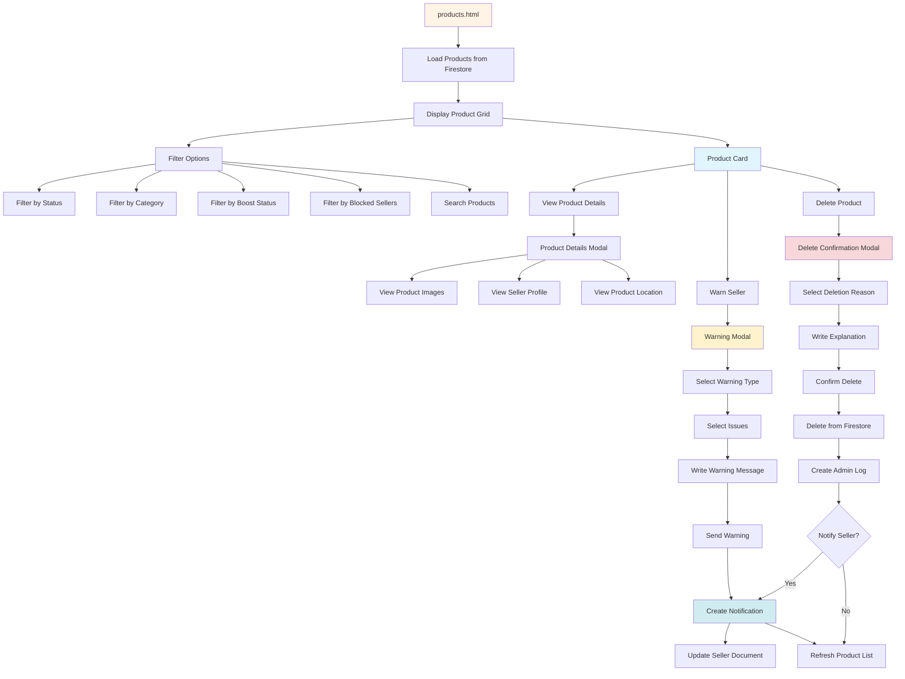

---

## ✓ ID Verification Flow

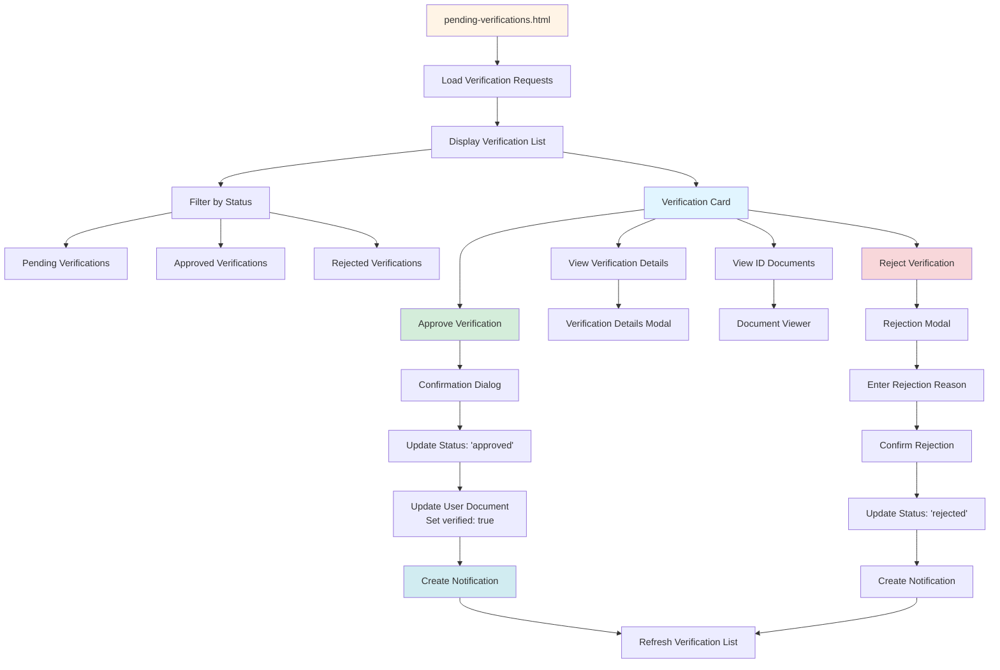

---

## 💰 Payment Management Flow

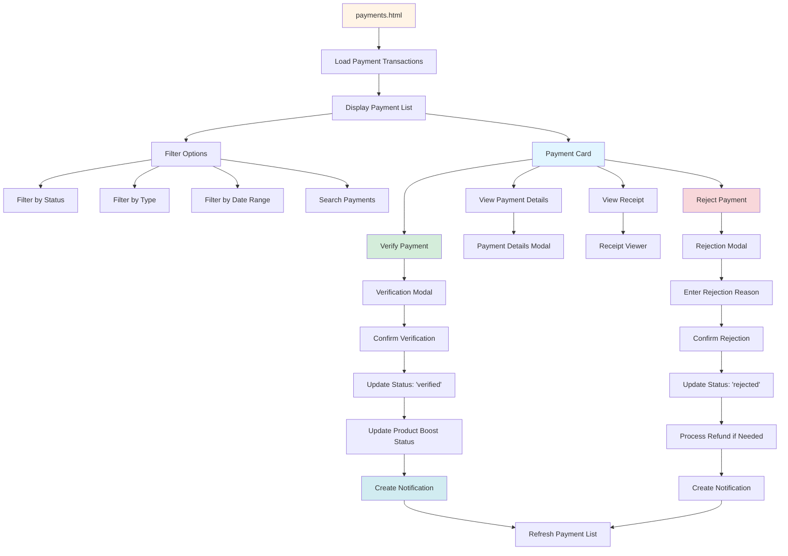

---

## 🎫 Report Tickets Flow

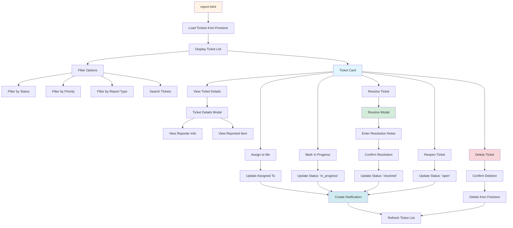

---

## 💬 Customer Support Flow

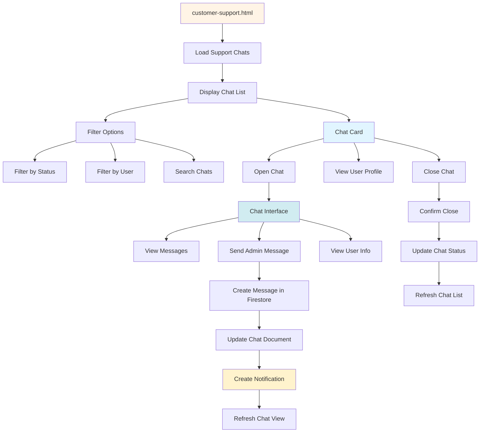

---

## ⚙️ Settings Flow

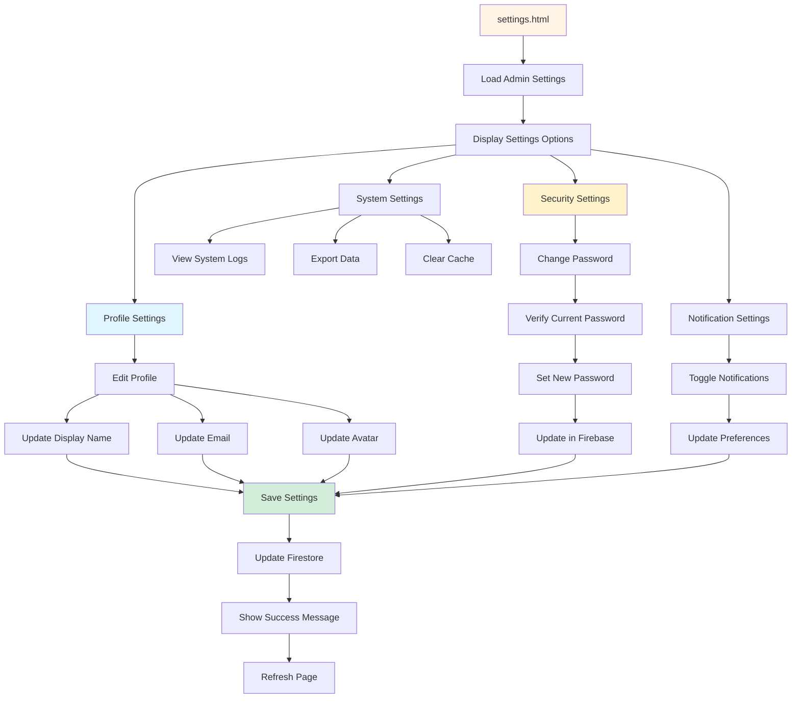

---

## 🔄 Logout Flow

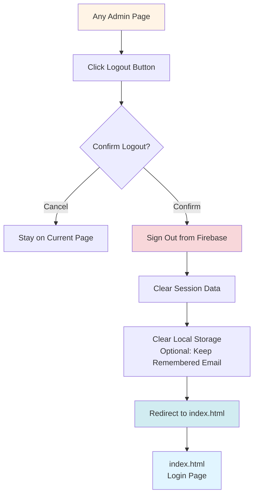

---

## 📱 Real-time Updates Flow

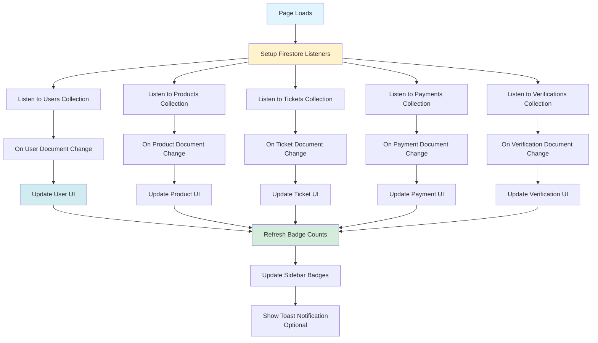

---

## 🔐 Security & Authentication Checks

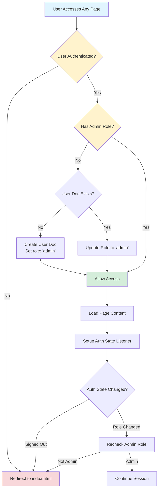

---

## 📊 Data Flow Summary

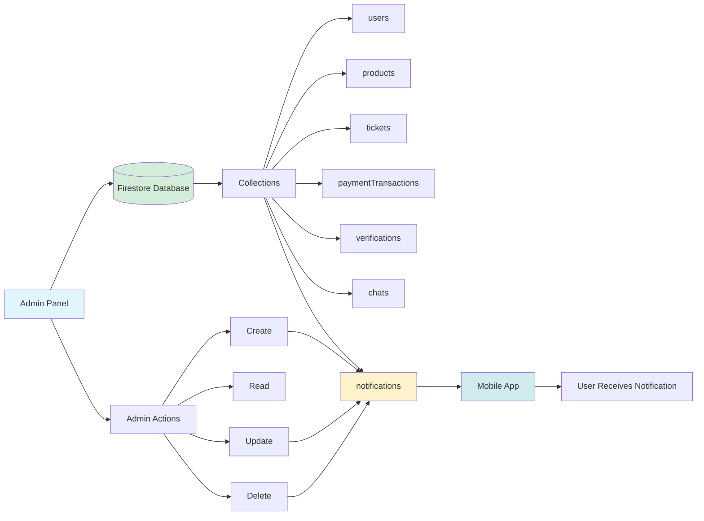

---

## 🎯 Key Features Summary

### Authentication
- ✅ Email/Password login
- ✅ Default admin auto-creation
- ✅ Role-based access control
- ✅ Session management
- ✅ Remember me functionality

### Dashboard
- ✅ Real-time metrics
- ✅ Activity feed
- ✅ Charts and graphs
- ✅ Quick navigation

### User Management
- ✅ View all users
- ✅ Filter and search
- ✅ Enable/Disable users
- ✅ Send warnings
- ✅ View user products

### Product Management
- ✅ View all products
- ✅ Filter by status/category
- ✅ Warn sellers
- ✅ Delete products
- ✅ View product details

### ID Verification
- ✅ View verification requests
- ✅ Approve/Reject verifications
- ✅ View ID documents
- ✅ Update user verification status

### Payment Management
- ✅ View payment transactions
- ✅ Verify payments
- ✅ Reject payments
- ✅ View receipts
- ✅ Update product boost status

### Report Tickets
- ✅ View all tickets
- ✅ Filter by status/priority
- ✅ Assign tickets
- ✅ Resolve tickets
- ✅ Add resolution notes

### Customer Support
- ✅ View support chats
- ✅ Send messages
- ✅ View user profiles
- ✅ Close chats

### Settings
- ✅ Profile management
- ✅ Security settings
- ✅ Notification preferences
- ✅ System settings

---

## 🔄 Navigation Map

```
index.html (Login)
    ↓
dashboard.html (Main Hub)
    ├──→ users.html
    ├──→ products.html
    ├──→ pending-verifications.html
    ├──→ payments.html
    ├──→ report.html
    ├──→ customer-support.html
    └──→ settings.html
```

---

## 📝 Notes

- All pages require admin authentication
- Real-time updates via Firestore listeners
- Notifications sent to mobile app on actions
- All admin actions are logged
- Default admin: `agriconnect.admin@gmail.com` / `Test123!`
- Session persists until logout or expiration
- Badge counts update in real-time

---

**Last Updated:** 2025-01-13  
**Version:** 1.0

